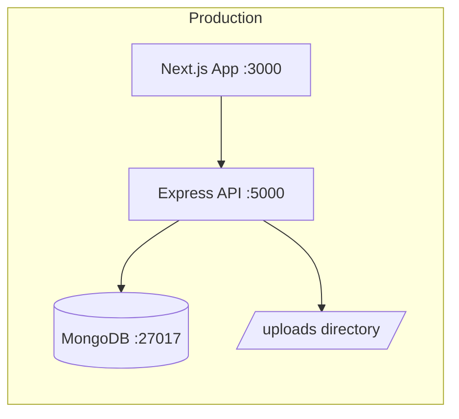
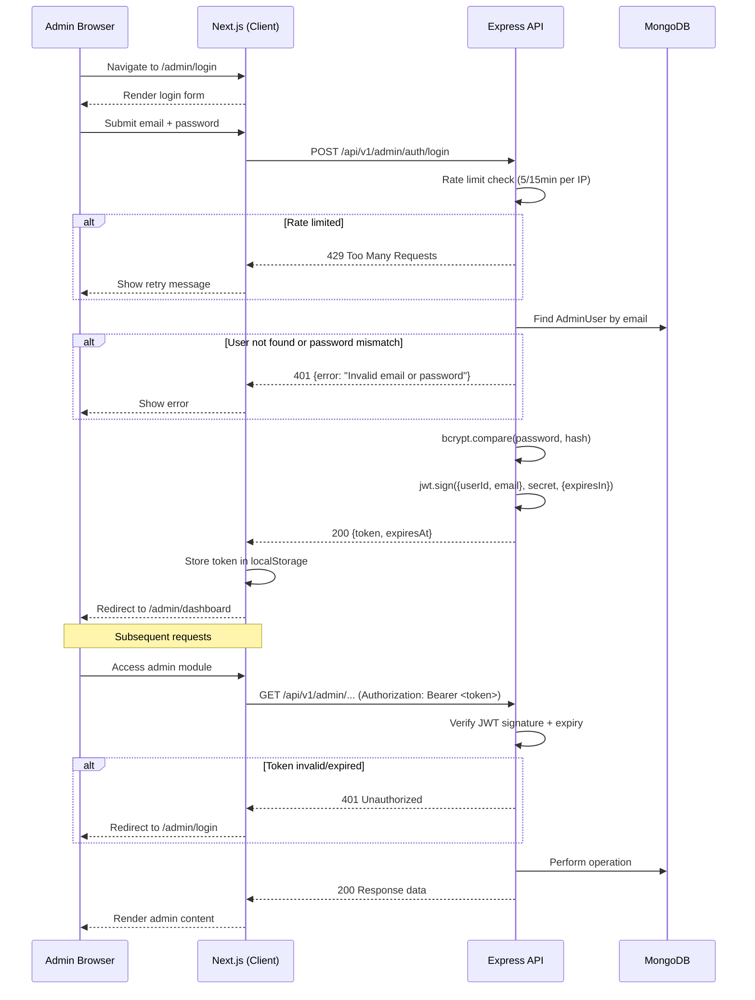
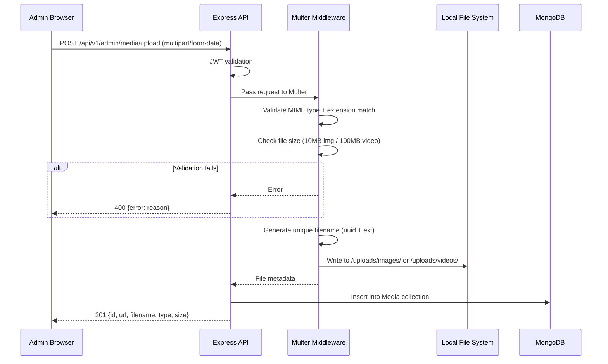

# Design Document: Meetvia Platform

## Overview

Meetvia is a CMS-powered, futuristic 3D web platform for professional public companionship and visitor assistance services in India. The system follows an API-first architecture with a clear separation between the public-facing Next.js frontend, an Express-based REST API backend, and a MongoDB data layer. All website content is admin-managed through a dashboard and served via versioned REST endpoints, enabling future mobile app integration.

### Key Design Decisions

1. **Next.js with SSR** — Server-side rendering for SEO and fast initial loads; API calls happen at request time so CMS edits are reflected immediately without rebuilds.
2. **Express API layer** — Lightweight, well-understood REST framework; versioned routes (`/api/v1/`) keep public and admin concerns separated.
3. **MongoDB with Mongoose** — Schema-flexible document store ideal for CMS content; Mongoose provides validation and middleware hooks.
4. **JWT stateless auth** — No server-side session store needed; tokens carry claims and are validated per-request.
5. **Local file storage with abstraction** — Files stored on disk initially; a storage adapter interface allows swapping to S3/Cloudinary later.
6. **Tailwind + Framer Motion + GSAP** — Utility-first CSS for responsive design; Framer Motion for declarative React animations; GSAP ScrollTrigger for scroll-pinned hero reveals.

---

## Architecture

### High-Level System Diagram

```mermaid
graph TB
    subgraph Client
        A[Visitor Browser] -->|HTTPS| B[Next.js Frontend]
        C[Admin Browser] -->|HTTPS| B
    end

    subgraph "Next.js Server (SSR)"
        B -->|Server-side fetch| D[Express API]
    end

    subgraph "Backend Services"
        D -->|Mongoose ODM| E[(MongoDB)]
        D -->|fs / Storage Adapter| F[Local File System]
    end

    subgraph "Middleware Stack"
        D --- G[JWT Auth Middleware]
        D --- H[Rate Limiter]
        D --- I[File Upload (Multer)]
        D --- J[Validation (Joi/Zod)]
    end
```

### Deployment Architecture



- **Next.js** runs on port 3000, serves both public pages (SSR) and admin SPA pages (CSR).
- **Express API** runs on port 5000, serves REST endpoints.
- **MongoDB** single instance (replica set optional for production).
- **File uploads** stored under `./uploads/` with subdirectories by type.

### Request Flow

1. Visitor requests `/services` → Next.js `getServerSideProps` fetches `GET /api/v1/public/services` → renders page with data.
2. Admin saves a service → Admin Panel calls `PUT /api/v1/admin/services/:id` with JWT in `Authorization` header → API validates token, validates body, updates MongoDB → returns updated document.
3. File upload → Admin Panel sends `POST /api/v1/admin/media/upload` multipart form → Multer middleware stores file → API saves metadata to Media collection → returns file reference.

---

## Components and Interfaces

### Backend Component Structure

```
backend/
├── src/
│   ├── server.js                 # Express app entry point
│   ├── config/
│   │   ├── db.js                 # MongoDB connection
│   │   ├── env.js                # Environment variable loader
│   │   └── seed.js               # Database seeder
│   ├── middleware/
│   │   ├── auth.js               # JWT verification middleware
│   │   ├── rateLimiter.js        # Rate limiting (express-rate-limit)
│   │   ├── upload.js             # Multer file upload config
│   │   ├── validate.js           # Request validation wrapper
│   │   └── errorHandler.js       # Global error handler
│   ├── models/
│   │   ├── AdminUser.js
│   │   ├── SiteSettings.js
│   │   ├── ThemeSettings.js
│   │   ├── HeroSlide.js
│   │   ├── Service.js
│   │   ├── Media.js
│   │   ├── FAQ.js
│   │   ├── Testimonial.js
│   │   ├── City.js
│   │   ├── ContactInquiry.js
│   │   ├── CompanionApplication.js
│   │   ├── LegalPage.js
│   │   └── SocialLink.js
│   ├── routes/
│   │   ├── public/               # No auth required
│   │   │   ├── theme.js
│   │   │   ├── hero.js
│   │   │   ├── services.js
│   │   │   ├── cities.js
│   │   │   ├── faq.js
│   │   │   ├── testimonials.js
│   │   │   ├── pages.js
│   │   │   ├── footer.js
│   │   │   ├── siteSettings.js
│   │   │   ├── contact.js        # POST for form submission
│   │   │   └── companion.js      # POST for application
│   │   └── admin/                # JWT required
│   │       ├── auth.js           # Login endpoint
│   │       ├── theme.js
│   │       ├── hero.js
│   │       ├── services.js
│   │       ├── cities.js
│   │       ├── faq.js
│   │       ├── testimonials.js
│   │       ├── pages.js
│   │       ├── footer.js
│   │       ├── siteSettings.js
│   │       ├── media.js
│   │       ├── inquiries.js
│   │       ├── companions.js
│   │       └── dashboard.js
│   ├── controllers/              # Business logic
│   │   └── [mirrors routes]
│   ├── validators/               # Joi/Zod schemas
│   │   └── [per-resource schemas]
│   └── utils/
│       ├── storage.js            # Storage adapter interface
│       ├── jwt.js                # Token sign/verify helpers
│       └── password.js           # bcrypt hash/compare helpers
├── uploads/                      # Local file storage
│   ├── images/
│   └── videos/
├── .env.example
├── package.json
└── seed-data/                    # JSON seed files
    └── defaults.json
```

### Frontend Component Structure

```
frontend/
├── src/
│   ├── app/                          # Next.js App Router
│   │   ├── layout.tsx                # Root layout (navbar, footer, theme provider)
│   │   ├── page.tsx                  # Home page
│   │   ├── services/page.tsx
│   │   ├── become-companion/page.tsx
│   │   ├── contact/page.tsx
│   │   ├── faq/page.tsx
│   │   ├── testimonials/page.tsx
│   │   ├── safety-policy/page.tsx
│   │   ├── terms-of-service/page.tsx
│   │   ├── privacy-policy/page.tsx
│   │   ├── refund-policy/page.tsx
│   │   ├── not-found.tsx             # 404 page
│   │   └── admin/
│   │       ├── login/page.tsx
│   │       └── dashboard/
│   │           ├── layout.tsx        # Admin sidebar layout
│   │           ├── page.tsx          # Dashboard overview
│   │           ├── theme/page.tsx
│   │           ├── hero/page.tsx
│   │           ├── services/page.tsx
│   │           ├── media/page.tsx
│   │           ├── faq/page.tsx
│   │           ├── testimonials/page.tsx
│   │           ├── cities/page.tsx
│   │           ├── inquiries/page.tsx
│   │           ├── companions/page.tsx
│   │           ├── pages/page.tsx
│   │           ├── footer/page.tsx
│   │           └── settings/page.tsx
│   ├── components/
│   │   ├── layout/
│   │   │   ├── Navbar.tsx
│   │   │   ├── Footer.tsx
│   │   │   └── AdminSidebar.tsx
│   │   ├── home/
│   │   │   ├── HeroSection.tsx
│   │   │   ├── HowItWorks.tsx
│   │   │   ├── SafetySection.tsx
│   │   │   ├── ServicesPreview.tsx
│   │   │   ├── BecomeCompanion.tsx
│   │   │   ├── CitiesSection.tsx
│   │   │   ├── FAQPreview.tsx
│   │   │   ├── TestimonialsPreview.tsx
│   │   │   └── ContactSection.tsx
│   │   ├── ui/
│   │   │   ├── GlassCard.tsx         # 3D glassmorphism card
│   │   │   ├── Button.tsx
│   │   │   ├── Input.tsx
│   │   │   ├── Accordion.tsx
│   │   │   ├── Modal.tsx
│   │   │   ├── FileUpload.tsx
│   │   │   ├── RichTextEditor.tsx
│   │   │   └── Pagination.tsx
│   │   ├── forms/
│   │   │   ├── ContactForm.tsx
│   │   │   └── CompanionForm.tsx
│   │   └── admin/
│   │       ├── StatsCard.tsx
│   │       ├── DataTable.tsx
│   │       ├── ThemePreview.tsx
│   │       └── MediaGrid.tsx
│   ├── lib/
│   │   ├── api.ts                    # API client (fetch wrapper)
│   │   ├── auth.ts                   # JWT helpers (store/read/clear)
│   │   └── theme.ts                  # Theme CSS variable applicator
│   ├── hooks/
│   │   ├── useAuth.ts                # Auth state hook
│   │   ├── useReducedMotion.ts       # prefers-reduced-motion detection
│   │   └── useTheme.ts              # Theme context consumer
│   ├── context/
│   │   ├── AuthContext.tsx
│   │   └── ThemeContext.tsx
│   └── types/
│       └── index.ts                  # TypeScript interfaces
├── public/
│   ├── placeholder.webp              # Default placeholder image
│   └── favicon.ico
├── tailwind.config.ts
├── next.config.ts
└── package.json
```

### API Endpoint Design

#### Public Endpoints (No Auth — `/api/v1/public/`)

| Method | Path | Description |
|--------|------|-------------|
| GET | /api/v1/public/site-settings | Get site name, logo, meta, WhatsApp config |
| GET | /api/v1/public/theme | Get active theme settings |
| GET | /api/v1/public/hero-slides | Get visible hero slides sorted by order |
| GET | /api/v1/public/services | Get visible services sorted by order |
| GET | /api/v1/public/services/featured | Get featured services (max 6) for homepage |
| GET | /api/v1/public/cities | Get active cities sorted by order |
| GET | /api/v1/public/faq | Get all FAQs sorted by order |
| GET | /api/v1/public/faq/preview | Get first 6 FAQs for homepage |
| GET | /api/v1/public/testimonials | Get verified+visible testimonials |
| GET | /api/v1/public/testimonials/preview | Get max 3 for homepage |
| GET | /api/v1/public/pages/:slug | Get legal page by slug |
| GET | /api/v1/public/footer | Get footer description + social links |
| GET | /api/v1/public/how-it-works | Get How It Works steps |
| POST | /api/v1/public/contact | Submit contact inquiry |
| POST | /api/v1/public/companion-application | Submit companion application |

#### Admin Endpoints (JWT Required — `/api/v1/admin/`)

| Method | Path | Description |
|--------|------|-------------|
| POST | /api/v1/admin/auth/login | Authenticate, return JWT |
| GET | /api/v1/admin/dashboard/stats | Get summary statistics |
| GET/PUT | /api/v1/admin/site-settings | Read/update site settings |
| GET/PUT | /api/v1/admin/theme | Read/update theme settings |
| GET/POST/PUT/DELETE | /api/v1/admin/hero-slides[/:id] | CRUD hero slides |
| PUT | /api/v1/admin/hero-slides/reorder | Bulk reorder slides |
| GET/POST/PUT/DELETE | /api/v1/admin/services[/:id] | CRUD services |
| GET/POST/PUT/DELETE | /api/v1/admin/faq[/:id] | CRUD FAQs |
| GET/POST/PUT/DELETE | /api/v1/admin/testimonials[/:id] | CRUD testimonials |
| GET/POST/PUT/DELETE | /api/v1/admin/cities[/:id] | CRUD cities |
| GET/PUT | /api/v1/admin/pages/:slug | Read/update legal pages |
| GET/PUT | /api/v1/admin/footer | Read/update footer |
| GET/POST/DELETE | /api/v1/admin/social-links[/:id] | CRUD social links |
| POST | /api/v1/admin/media/upload | Upload file |
| GET | /api/v1/admin/media | List media (paginated, filterable) |
| DELETE | /api/v1/admin/media/:id | Delete media file + metadata |
| GET | /api/v1/admin/inquiries | List inquiries (filterable) |
| PUT | /api/v1/admin/inquiries/:id | Update inquiry status/notes |
| GET | /api/v1/admin/companions | List applications (filterable) |
| PUT | /api/v1/admin/companions/:id | Update application status/notes |
| GET/PUT | /api/v1/admin/how-it-works | Read/update How It Works steps |

### Authentication Flow



### File Upload Architecture



**Storage Adapter Interface (for future cloud migration):**

```typescript
interface StorageAdapter {
  upload(file: Buffer, filename: string, mimeType: string): Promise<string>; // returns URL/path
  delete(filepath: string): Promise<void>;
  getUrl(filepath: string): string;
}

class LocalStorageAdapter implements StorageAdapter { /* fs operations */ }
// Future: class S3StorageAdapter implements StorageAdapter { /* AWS SDK */ }
```

### Theme System Design

The theme system operates in three layers:

1. **Database (source of truth)** — `ThemeSettings` collection stores active theme values.
2. **API delivery** — Public endpoint serves theme as JSON.
3. **CSS Variables (runtime application)** — Next.js applies theme values as CSS custom properties on `<html>`.

```typescript
// Theme context applies values to CSS variables
function applyTheme(theme: ThemeSettings) {
  const root = document.documentElement;
  root.style.setProperty('--color-primary', theme.primaryColor);
  root.style.setProperty('--color-secondary', theme.secondaryColor);
  root.style.setProperty('--color-accent', theme.accentColor);
  root.style.setProperty('--color-background', theme.backgroundColor);
  root.style.setProperty('--color-text', theme.textColor);
  root.style.setProperty('--font-family', theme.fontFamily);
  root.style.setProperty('--border-radius', `${theme.borderRadius}px`);
  root.style.setProperty('--glass-intensity', `${theme.glassmorphismIntensity}`);
}
```

**Tailwind Integration** — `tailwind.config.ts` references CSS variables:

```typescript
// tailwind.config.ts
theme: {
  extend: {
    colors: {
      primary: 'var(--color-primary)',
      secondary: 'var(--color-secondary)',
      accent: 'var(--color-accent)',
      background: 'var(--color-background)',
      text: 'var(--color-text)',
    },
    fontFamily: {
      sans: 'var(--font-family)',
    },
    borderRadius: {
      theme: 'var(--border-radius)',
    }
  }
}
```

**Preset Definitions:**

| Preset | Primary | Secondary | Accent | Background | Text |
|--------|---------|-----------|--------|------------|------|
| Futuristic Blue | #FFFFFF | #0A1628 | #00D4FF | #0A1628 | #FFFFFF |
| Luxury Dark | #C9A96E | #1A1A2E | #FFD700 | #1A1A2E | #F5F5F5 |
| Clean White | #1A1A2E | #FFFFFF | #3B82F6 | #FFFFFF | #1A1A2E |

---

## Data Models

### Collection Schemas (Mongoose)

#### 1. AdminUser

```typescript
{
  email: { type: String, required: true, unique: true },
  password: { type: String, required: true },  // bcrypt hash, min cost 10
  name: { type: String, required: true },
  createdAt: { type: Date, default: Date.now },
  updatedAt: { type: Date, default: Date.now }
}
```

#### 2. SiteSettings (Singleton)

```typescript
{
  siteName: { type: String, required: true, maxlength: 100 },
  siteLogo: { type: String },          // path/URL to logo file
  favicon: { type: String },           // path/URL to favicon
  metaTitle: { type: String, required: true, maxlength: 60 },
  metaDescription: { type: String, maxlength: 160 },
  contactEmail: { type: String },
  contactPhone: { type: String },
  whatsappNumber: { type: String },
  whatsappMessage: { type: String },
  safetyCheckboxText: { type: String },
  createdAt: Date,
  updatedAt: Date
}
```

#### 3. ThemeSettings (Singleton)

```typescript
{
  activePreset: { type: String, enum: ['futuristic-blue', 'luxury-dark', 'clean-white', 'custom'] },
  primaryColor: { type: String, required: true },     // hex color
  secondaryColor: { type: String, required: true },
  accentColor: { type: String, required: true },
  backgroundColor: { type: String, required: true },
  textColor: { type: String, required: true },
  fontFamily: { type: String, required: true },
  borderRadius: { type: Number, min: 0, max: 32, default: 12 },
  glassmorphismIntensity: { type: Number, min: 0, max: 100, default: 50 },
  createdAt: Date,
  updatedAt: Date
}
```

#### 4. HeroSlide

```typescript
{
  heading: { type: String, required: true, maxlength: 200 },
  subtitle: { type: String, maxlength: 500 },
  backgroundImage: { type: String },     // path/URL
  backgroundVideo: { type: String },     // path/URL
  overlayOpacity: { type: Number, min: 0, max: 100, default: 40 },
  includesList: [{ type: String }],
  ctaText: { type: String },
  ctaLink: { type: String },
  displayOrder: { type: Number, default: 0 },
  isVisible: { type: Boolean, default: true },
  createdAt: Date,
  updatedAt: Date
}
```

#### 5. Service

```typescript
{
  title: { type: String, required: true, maxlength: 100 },
  description: { type: String, required: true, maxlength: 500 },
  duration: { type: String },
  locationType: { type: String, enum: ['Public', 'Virtual', 'Flexible'], required: true },
  image: { type: String },
  video: { type: String },
  thumbnail: { type: String },
  whatsIncluded: [{ type: String }],
  buttonText: { type: String, default: 'Book Now' },
  buttonLink: { type: String },
  isFeatured: { type: Boolean, default: false },
  isVisible: { type: Boolean, default: true },
  displayOrder: { type: Number, default: 0 },
  createdAt: Date,
  updatedAt: Date
}
```

#### 6. Media

```typescript
{
  originalFilename: { type: String, required: true },
  storedFilename: { type: String, required: true, unique: true },
  fileType: { type: String, enum: ['image', 'video'], required: true },
  mimeType: { type: String, required: true },
  fileSize: { type: Number, required: true },  // bytes
  storagePath: { type: String, required: true },
  url: { type: String, required: true },
  createdAt: Date,
  updatedAt: Date
}
```

#### 7. FAQ

```typescript
{
  question: { type: String, required: true, maxlength: 200 },
  answer: { type: String, required: true, maxlength: 2000 },
  displayOrder: { type: Number, default: 0 },
  createdAt: Date,
  updatedAt: Date
}
```

#### 8. Testimonial

```typescript
{
  reviewerName: { type: String, required: true, maxlength: 100 },
  location: { type: String, maxlength: 100 },
  reviewText: { type: String, required: true, maxlength: 500 },
  rating: { type: Number, min: 1, max: 5 },
  image: { type: String },
  isVerified: { type: Boolean, default: false },
  isVisible: { type: Boolean, default: true },
  displayOrder: { type: Number, default: 0 },
  createdAt: Date,
  updatedAt: Date
}
```

#### 9. City

```typescript
{
  cityName: { type: String, required: true, maxlength: 100 },
  state: { type: String, required: true, maxlength: 100 },
  country: { type: String, required: true, maxlength: 100 },
  status: { type: String, enum: ['active', 'inactive'], default: 'active' },
  displayOrder: { type: Number, default: 0 },
  createdAt: Date,
  updatedAt: Date
}
// Compound unique index on { cityName, state }
```

#### 10. ContactInquiry

```typescript
{
  fullName: { type: String, required: true, maxlength: 100 },
  email: { type: String, required: true },
  mobile: { type: String },
  serviceType: { type: String, required: true },
  preferredDate: { type: Date },
  message: { type: String, required: true, maxlength: 2000 },
  safetyConfirmed: { type: Boolean, required: true, default: true },
  status: { type: String, enum: ['new', 'reviewed', 'contacted', 'closed', 'rejected'], default: 'new' },
  adminNotes: { type: String },
  createdAt: Date,
  updatedAt: Date
}
```

#### 11. CompanionApplication

```typescript
{
  fullName: { type: String, required: true, maxlength: 100 },
  email: { type: String, required: true },
  mobile: { type: String, required: true },   // 10-digit Indian mobile
  city: { type: String, required: true },
  experience: { type: String, required: true, maxlength: 1000 },
  whyJoin: { type: String, required: true, maxlength: 1000 },
  status: { type: String, enum: ['pending', 'reviewing', 'approved', 'rejected'], default: 'pending' },
  adminNotes: { type: String },
  createdAt: Date,
  updatedAt: Date
}
```

#### 12. LegalPage

```typescript
{
  slug: { type: String, required: true, unique: true, enum: ['safety-policy', 'terms-of-service', 'privacy-policy', 'refund-policy'] },
  title: { type: String, required: true },
  content: { type: String, required: true, maxlength: 100000 },  // rich-text HTML
  createdAt: Date,
  updatedAt: Date
}
```

#### 13. SocialLink

```typescript
{
  platform: { type: String, required: true },
  url: { type: String, required: true },
  iconIdentifier: { type: String, required: true },
  isVisible: { type: Boolean, default: true },
  displayOrder: { type: Number, default: 0 },
  createdAt: Date,
  updatedAt: Date
}
```

#### 14. HowItWorksStep

```typescript
{
  stepNumber: { type: Number, required: true },
  title: { type: String, required: true, maxlength: 100 },
  description: { type: String, required: true, maxlength: 300 },
  displayOrder: { type: Number, default: 0 },
  createdAt: Date,
  updatedAt: Date
}
```

---

## Correctness Properties

*A property is a characteristic or behavior that should hold true across all valid executions of a system — essentially, a formal statement about what the system should do. Properties serve as the bridge between human-readable specifications and machine-verifiable correctness guarantees.*

### Property 1: Admin Route Protection

*For any* HTTP request to an endpoint under `/api/v1/admin/` that does not include a valid JWT in the Authorization header, the server SHALL return a 401 Unauthorized response and SHALL NOT execute the requested operation.

**Validates: Requirements 1.4, 2.4, 19.1**

### Property 2: Invalid Token Rejection

*For any* JWT token that is expired, malformed, or signed with an incorrect secret, when presented to any admin endpoint, the server SHALL return a 401 Unauthorized response with a JSON body containing an error message.

**Validates: Requirements 1.5, 19.7**

### Property 3: Seed Script Idempotence

*For any* MongoDB collection that already contains one or more documents, running the seed script SHALL leave that collection unchanged (same document count and content before and after seeding).

**Validates: Requirements 1.6**

### Property 4: API JSON Response Format

*For any* public API endpoint, the response Content-Type SHALL be `application/json` and the response body SHALL be parseable as valid JSON.

**Validates: Requirements 1.7**

### Property 5: Theme Field Validation

*For any* theme settings update request, if a color field value is not a valid 7-character hex color code (e.g., `#RRGGBB`), or if borderRadius is outside the range [0, 32], or if glassmorphismIntensity is outside the range [0, 100], the server SHALL reject the update and return a validation error.

**Validates: Requirements 3.2, 3.9**

### Property 6: Schema Maxlength Enforcement

*For any* document creation or update request where a string field exceeds its defined maximum length (e.g., heading > 200, service title > 100, FAQ question > 200, legal page content > 100,000), the server SHALL reject the operation and return a validation error indicating the violating field.

**Validates: Requirements 4.2, 5.2, 10.1, 13.6, 18.1**

### Property 7: Undefined Routes Return 404

*For any* URL path that does not match a defined public or admin route, the application SHALL return a 404 response (or render a 404 page with a link to the home page).

**Validates: Requirements 6.6**

### Property 8: Form Input Validation

*For any* contact form or companion application submission where a required field is empty, an email field does not match valid email format, or a mobile number is not a valid 10-digit Indian number, the system SHALL reject the submission and indicate which fields are invalid.

**Validates: Requirements 8.1, 8.4, 9.2, 9.4, 18.4**

### Property 9: Form Submission Data Integrity

*For any* valid contact inquiry or companion application submission, the document stored in MongoDB SHALL contain all submitted field values unchanged, the status field SHALL be set to the default value ("new" for inquiries, "pending" for applications), and the createdAt timestamp SHALL be set.

**Validates: Requirements 8.7, 9.5**

### Property 10: Display Order Ascending Sort

*For any* collection that has a displayOrder field (HeroSlide, Service, FAQ, Testimonial, City, SocialLink), the public API endpoint SHALL return documents sorted by displayOrder in ascending order.

**Validates: Requirements 10.5, 12.3, 12.4, 20.5**

### Property 11: Testimonial Visibility Filtering

*For any* set of testimonials in the database with varying `isVerified` and `isVisible` states, the public testimonials endpoint SHALL return only those testimonials where both `isVerified` is true AND `isVisible` is true.

**Validates: Requirements 11.3**

### Property 12: Duplicate City Rejection

*For any* city creation request where the combination of cityName and state already exists in the database, the server SHALL reject the insertion and return an error indicating the city already exists.

**Validates: Requirements 12.6**

### Property 13: URL Format Validation

*For any* social link creation or update request where the URL field value does not conform to a valid URL format (must include protocol and valid domain), the server SHALL reject the operation and return a validation error.

**Validates: Requirements 14.4, 14.7**

### Property 14: File Upload Type and MIME Validation

*For any* file upload request, if the file's detected MIME type does not match the declared file extension, or if the MIME type is not in the allowed set (image/jpeg, image/png, image/webp, image/svg+xml, video/mp4, video/webm), or if the file exceeds size limits (10MB for images, 100MB for videos), the server SHALL reject the upload.

**Validates: Requirements 15.1, 15.3, 19.3**

### Property 15: File Storage Unique Naming

*For any* two file uploads with the same original filename, the storage system SHALL assign distinct generated filenames to both files, and both SHALL be retrievable from the file system independently.

**Validates: Requirements 15.2, 15.8**

### Property 16: Upload Rejection Error Specificity

*For any* rejected file upload, the error response SHALL specify the exact reason — either "file size exceeded" for oversized files OR "unsupported file type" for disallowed types — rather than a generic error.

**Validates: Requirements 15.4**

### Property 17: Rate Limiting Enforcement

*For any* IP address that sends more than 5 login requests within a 15-minute window, the 6th and subsequent requests SHALL receive a 429 response with a retry delay indication, regardless of whether the credentials are valid.

**Validates: Requirements 19.6**

### Property 18: Schema Validation with Field-Level Errors

*For any* document insert or update that violates a schema constraint (missing required field, wrong type, value out of range), the server SHALL reject the operation and return an error response identifying which specific field failed validation.

**Validates: Requirements 20.2, 20.3**

### Property 19: Timestamp Auto-Management

*For any* document inserted into any collection, `createdAt` SHALL be automatically set to the current time. *For any* subsequent update to that document, `updatedAt` SHALL be automatically set to a time equal to or after the previous `updatedAt` value.

**Validates: Requirements 20.4**

---

## Error Handling

### Backend Error Strategy

All errors flow through a centralized error handler middleware (`errorHandler.js`):

```typescript
// Error response format
interface ErrorResponse {
  success: false;
  error: {
    message: string;       // Human-readable message
    field?: string;        // Specific field that failed (for validation)
    code?: string;         // Machine-readable error code
  };
}

// HTTP status code mapping
// 400 - Validation errors (schema, format, range)
// 401 - Authentication failures (missing/invalid/expired JWT)
// 404 - Resource not found
// 409 - Conflict (duplicate city, etc.)
// 413 - File too large
// 415 - Unsupported media type
// 429 - Rate limited
// 500 - Internal server error (logged, generic message to client)
```

### Error Categories

| Category | Status | Client Message | Logging |
|----------|--------|---------------|---------|
| Validation | 400 | Field-specific error | Debug level |
| Auth | 401 | Generic "Invalid email or password" | Warn level |
| Not Found | 404 | "Resource not found" | Debug level |
| Duplicate | 409 | "City already exists" | Info level |
| File Size | 413 | "File size exceeded (max 10MB for images)" | Info level |
| File Type | 415 | "Unsupported file type" | Info level |
| Rate Limit | 429 | "Too many attempts. Try again in X minutes" | Warn level |
| Server Error | 500 | "Internal server error" | Error level (full stack) |

### Frontend Error Handling

- **API fetch failures**: Show toast notification with retry option
- **Form validation**: Inline field-level error messages (red text below field)
- **Auth failures**: Redirect to login with flash message
- **404 pages**: Friendly message with link to home
- **Theme API failure**: Silent fallback to default Futuristic Blue theme
- **Legal page unavailable**: Display "temporarily unavailable" message

### Validation Approach

- **Backend**: Joi/Zod schemas validate request bodies before reaching controllers
- **Frontend**: React Hook Form with Zod resolvers for client-side validation
- **Both layers validate** — frontend for UX speed, backend as authoritative gatekeeper

---

## Testing Strategy

### Dual Testing Approach

This project uses both unit/example tests and property-based tests for comprehensive coverage.

### Property-Based Testing

**Library**: [fast-check](https://github.com/dubzzz/fast-check) (JavaScript/TypeScript PBT library)

**Configuration**:
- Minimum 100 iterations per property test
- Each test tagged with comment referencing design property
- Tag format: `// Feature: meetvia-platform, Property {N}: {title}`

**Properties to implement** (from Correctness Properties section):
- Property 1: Admin route protection — generate random admin paths and invalid tokens
- Property 2: Invalid token rejection — generate expired/malformed/wrong-secret JWTs
- Property 3: Seed idempotence — pre-populate collections and verify seed is no-op
- Property 4: JSON response format — hit all public endpoints, verify JSON parse succeeds
- Property 5: Theme validation — generate invalid hex codes and out-of-range numbers
- Property 6: Maxlength enforcement — generate strings exceeding defined limits
- Property 7: 404 for undefined routes — generate random non-existent URL paths
- Property 8: Form input validation — generate invalid emails, empty fields, bad mobile numbers
- Property 9: Submission data integrity — generate valid form data, submit, read back, compare
- Property 10: Display order sorting — generate documents with random orders, verify sort
- Property 11: Testimonial filtering — generate testimonials with random verified/visible flags
- Property 12: Duplicate city rejection — insert same city name+state twice
- Property 13: URL format validation — generate random strings, verify URL validation
- Property 14: File upload validation — generate files with mismatched MIME/extensions
- Property 15: Unique file naming — upload same filename multiple times
- Property 16: Error specificity — generate oversized and wrong-type files, check messages
- Property 17: Rate limiting — simulate N requests from same IP
- Property 18: Schema validation — generate documents with missing/invalid fields
- Property 19: Timestamp management — insert and update documents, verify timestamps

### Unit / Example-Based Tests

**Framework**: Jest (backend) + Jest + React Testing Library (frontend)

**Coverage areas**:
- Authentication flow (login success, login failure, token refresh)
- Admin CRUD operations for each module
- Form submission success/failure paths
- Theme preset loading and preview
- Conditional rendering (empty states, single-slide hero, etc.)
- Responsive layout breakpoints
- Accessibility: keyboard navigation, ARIA attributes, reduced-motion respect

### Integration Tests

**Tool**: Supertest (API integration) + Playwright (E2E)

**Coverage areas**:
- Full SSR page rendering with live API
- Contact form → DB storage → admin view flow
- Companion application submission → status update flow
- File upload → media library → usage in content flow
- Theme change → website reflects change flow
- Seed script execution on fresh database

### Test Organization

```
backend/
├── tests/
│   ├── unit/
│   │   ├── validators/       # Schema validation tests
│   │   ├── middleware/       # Auth, rate-limit, upload middleware
│   │   └── utils/           # JWT, bcrypt, storage helpers
│   ├── property/
│   │   ├── auth.property.test.ts      # Properties 1, 2, 17
│   │   ├── seed.property.test.ts      # Property 3
│   │   ├── api.property.test.ts       # Properties 4, 7
│   │   ├── validation.property.test.ts # Properties 5, 6, 8, 13, 18
│   │   ├── data.property.test.ts      # Properties 9, 10, 11, 12, 19
│   │   └── upload.property.test.ts    # Properties 14, 15, 16
│   └── integration/
│       ├── auth.integration.test.ts
│       ├── services.integration.test.ts
│       └── media.integration.test.ts

frontend/
├── __tests__/
│   ├── components/           # Component render tests
│   ├── forms/               # Form validation + submission
│   ├── hooks/               # Custom hook tests
│   └── e2e/                 # Playwright E2E tests
```

### SEO and Performance Considerations

**SEO**:
- Each page rendered server-side with unique `<title>` and `<meta name="description">` from SiteSettings + page-specific overrides
- Open Graph tags (`og:title`, `og:description`, `og:image`) on all pages
- Semantic HTML (`<header>`, `<nav>`, `<main>`, `<section>`, `<footer>`)
- Structured data (JSON-LD) for organization info on home page
- `robots.txt` and `sitemap.xml` generated from routes

**Performance**:
- Next.js Image optimization (`next/image`) for all CMS images
- Lazy loading for below-fold images and video elements
- Font preloading for custom theme font
- CSS inlined for critical path (Tailwind purging unused styles)
- API responses cached with short TTL (60s) for public read endpoints using HTTP cache headers
- MongoDB indexes on: `displayOrder` (all ordered collections), `email` (AdminUser, ContactInquiry), `slug` (LegalPage), `status` (City, ContactInquiry, CompanionApplication)
- Target LCP ≤ 2.5s on 4G mobile connection
- Bundle splitting per route (Next.js automatic code splitting)
